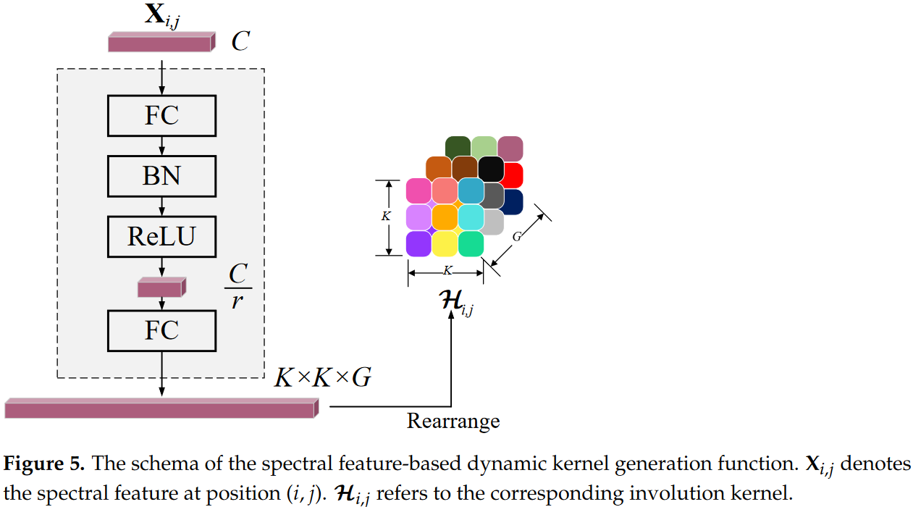

# Deep Residual Involution Network for Hyperspectral Image Classification

PyTorch implementation of deep residual involution network for hyperspectral image classification.



# Basic Usage

```
model = DRIN(num_classes=16, channels=200)
model.eval()
print(model)
input = torch.randn(100, 200, 11, 11)
y = model(input)
print(y.size())
```

# Paper

[Deep residual involution network for hyperspectral image classification](https://www.mdpi.com/2072-4292/13/16/3055)

Please cite our paper if you find it useful for your research.

```
@article{meng2021deep,
  title={Deep residual involution network for hyperspectral image classification},
  author={Meng, Zhe and Zhao, Feng and Liang, Miaomiao and Xie, Wen},
  journal={Remote Sensing},
  volume={13},
  number={16},
  pages={3055},
  year={2021},
  publisher={MDPI}
}
```

# Acknowledgment

This code is partly borrowed from [Involution](https://github.com/d-li14/involution)
